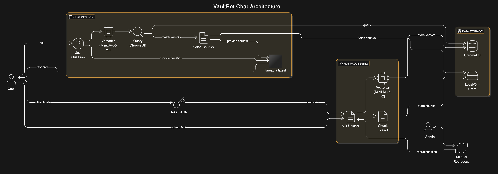

# VaultBot - Banking AI Assistant 🏦


**VaultBot is a powerful AI-powered banking assistant built on top of [OpenWebUI](https://github.com/open-webui/open-webui). It provides accurate, RAG-enhanced responses to banking product queries while operating completely offline.**

> 📘 **Project Documentation**: For detailed information about the project's development phases, implementation details, and technical decisions, please refer to the comprehensive documentation in the [`notebooks/`](./notebooks/) directory. This includes step-by-step guides, data processing workflows, and architecture decisions.

## 📚 Table of Contents

- [Overview](#-overview)
- [Key Features](#-key-features)
- [Architecture](#-architecture)
- [Quick Start](#-quick-start)
- [Methodology](#-methodology)
- [Data Pipeline](#-data-pipeline)
- [RAG Setup](#-rag-setup)
- [Development](#-development)
- [License](#-license)

## 🔍 Overview

VaultBot serves as an AI-powered banking assistant that leverages Retrieval Augmented Generation (RAG) to provide accurate, factual responses about banking products, rates, and services. It's designed to operate entirely offline with zero data leakage, making it ideal for sensitive banking environments.

Built on OpenWebUI's extensible platform, VaultBot delivers a seamless chat experience enhanced with a custom knowledge base containing comprehensive product information, FAQs, and up-to-date rate sheets.

## ✨ Key Features

- **Offline RAG Capabilities**: Fully offline operation with zero data leakage
- **Product Knowledge Base**: Comprehensive information on banking products, rates, and services
- **High-Quality Responses**: Accurate, factual answers driven by RAG-enhanced retrieval
- **Responsive Design**: Seamless experience across desktop and mobile devices
- **Easy Setup**: Quick installation through pip or Docker
- **Extensible Architecture**: Easy to update with new banking products or rate changes
- **Security-First Approach**: Built with data privacy and security as core principles

## 🏗️ Architecture



VaultBot follows a modular architecture:

1. **Frontend**: Modern web interface built on OpenWebUI's responsive design
2. **Backend**: Python-based API server with RAG processing capabilities
3. **Vector Database**: ChromaDB for efficient similarity search
4. **Embedding Model**: `sentence-transformers/all-MiniLM-L6-v2` for high-quality semantic embeddings
5. **LLM**: Meta's `llama3.2:3b` for efficient, accurate response generation

## 🚀 Quick Start

### Option 1: Python Installation

Requires Python 3.12+

```bash
# Clone the repository
git clone https://github.com/yourusername/vaultbot.git
cd vaultbot

# Install dependencies
pip install uv
uv sync

# Start the server
./backend/start.sh
```

### Option 2: Docker Installation

```bash
docker run -d -p 3000:8080 \
  -v vaultbot-data:/app/backend/data \
  --name vaultbot \
  --restart always \
  ghcr.io/yourusername/vaultbot:latest
```

After installation, access VaultBot at [http://localhost:8080](http://localhost:8080) (or port 3000 for Docker).

## 🧪 Methodology

### Model Selection

- **Embedding Model**: `sentence-transformers/all-MiniLM-L6-v2`
  - Lightweight (384 dimensions) with strong performance
  - Fast inference suitable for real-time queries
  - Low memory footprint, ideal for offline deployment
  - Top-performer for semantic search in similar-sized models

- **LLM**: `meta/llama3.2:3b`
  - 3B parameters provide good balance of performance and resource usage
  - Strong instruction-following capabilities
  - Efficient inference on consumer hardware
  - Low latency, critical for responsive chat interactions
  - Top performer on Open LLM Leaderboard for <6B parameter models

### Architecture Decisions

- **RAG Pipeline**: Chosen over fine-tuning to leverage existing knowledge while maintaining flexibility
- **Vector Store**: ChromaDB for fast similarity search and efficient storage
- **API Design**: RESTful endpoints for seamless frontend integration
- **Caching**: Response caching reduces LLM calls for common queries

## 📊 Data Pipeline

VaultBot's knowledge base is built through a comprehensive data preparation pipeline:

1. **Raw Data Collection**: Banking product information, FAQs, and rate sheets
2. **Data Transformation**:
   - JSON → Markdown for FAQ content
   - XLSX → CSV → Markdown for product details
   - Rate sheet CSV → Markdown tables
3. **Content Integration**: Merging into comprehensive RAG-ready document
4. **Manual Review**: Human verification to ensure high-quality content
5. **Embedding Generation**: Converting documents into vector embeddings

The data pipeline creates structured, high-quality content optimized for retrieval through the RAG system, ensuring accurate and relevant responses.

## 🧠 RAG Setup

VaultBot's RAG system is configured for optimal performance:

1. **Knowledge Base Configuration**:
   - Name: `NUST Bank QnA Databank`
   - Content: Comprehensive banking product information

2. **Model Configuration**:
   - Base Model: `llama3.2:latest`
   - Temperature: `0.2` (prioritizes factual consistency)
   - Context Length: `8192`
   - Other parameters optimized for banking Q&A

3. **RAG Settings**:
   - Chunk Size: `1000`
   - Chunk Overlap: `100`
   - Embedding Model: `sentence-transformers/all-MiniLM-L6-v2`
   - Top K: `3` (number of retrieved documents)

4. **Security Settings**:
   - Robust system instructions prevent prompt injection
   - Built-in safeguards against adversarial queries

## 💻 Development

### Prerequisites

- Python 3.12+
- Node.js 18+
- Git

### Setup Steps

1. Clone the repository
   ```bash
   git clone https://github.com/yourusername/vaultbot.git
   cd vaultbot
   ```

2. Build the frontend
   ```bash
   npm install
   npm run build
   ```

3. Install backend dependencies
   ```bash
   pip install uv
   uv sync
   ```

4. Start the development server
   ```bash
   ./backend/start.sh
   ```

### Project Structure

```
vaultbot/
├── backend/            # Python backend
├── data/               # RAG data
│   ├── processed/      # Final processed data
│   ├── processing/     # Intermediate files
│   └── raw/            # Raw input data
├── frontend/           # Web interface
├── notebooks/          # Jupyter notebooks
└── README.md           # This file
```

## 📜 License

This project is licensed under the [BSD-3-Clause License](LICENSE) - see the [LICENSE](LICENSE) file for details.

---

## Authors

- Ayesh Ahmad (365966)
- Farooq Afzal (365793)
- Muhammad Faras Siddiqui (365988)

Last Updated: May 4, 2025
